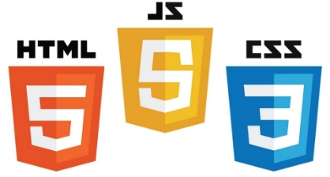
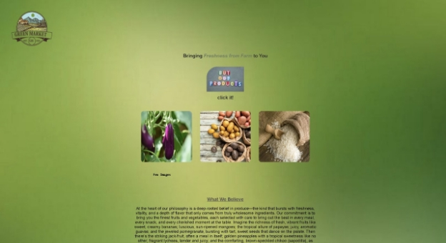
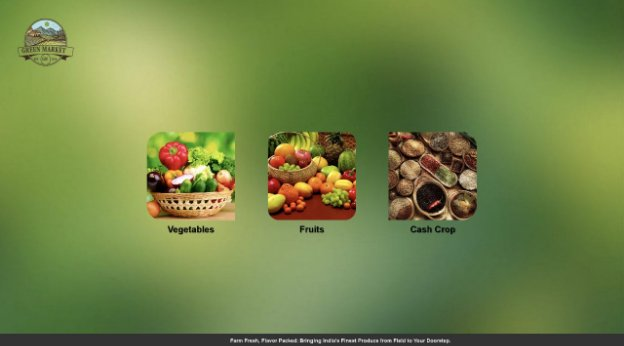
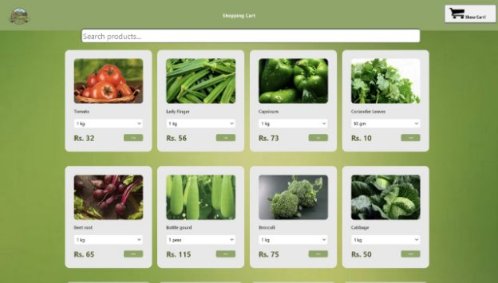
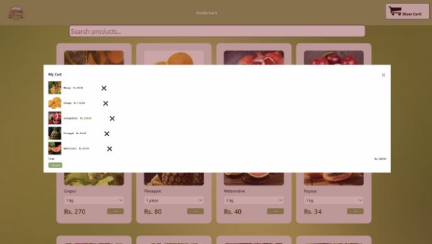
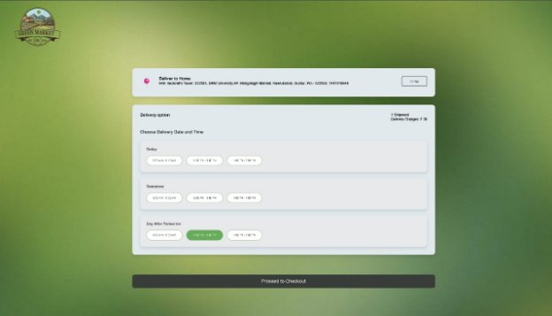
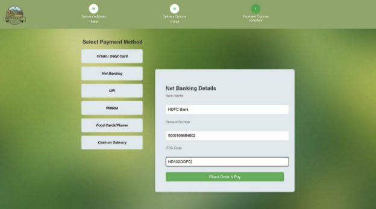
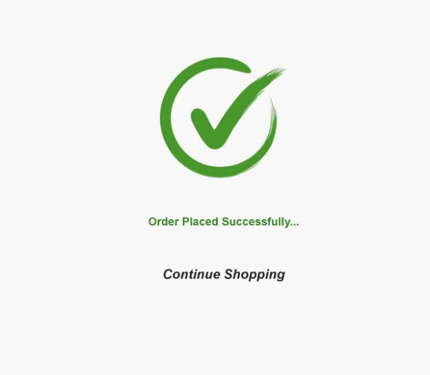

**TABLE OF CONTENTS:**

- About Our Project
- Technologies Used
- Website Overview
- Key Features
- Website Component

**About Our Project:**

Welcome to Green Market e-commerce platform designed to connect farmers directly with consumers and retailers, eliminating the need for intermediaries and empowering farmers to negotiate prices for their produce. This application provides farmers with a digital marketplace where they can list their crops, set prices, and communicate with potential buyers. The platform includes essential features to ensure smooth transactions, easy management of product listings, and secure payment options.

**Technologies Used:**

**Website Overview:**

Green Market is an innovative online platform designed to connect farmers directly with customers, eliminating the need for intermediaries and ensuring that consumers have access to fresh, high-quality produce straight from the source. Our goal is to create a seamless experience where customers can browse a variety of fresh, green products, select convenient delivery options, and provide feedback on their purchases—all through a user-friendly interface.

**Key Features:**

- Product Listing: Farmers can create listings for their produce, specifying the type, quantity, and expected price.
- Variety of Fresh Produce: We offer a wide selection of fruits, vegetables, herbs, and other farm-fresh products directly sourced from local farmers.
- Time Slot Management for Delivery: FreshFarm Connect allows customers to choose specific delivery time slots that fit their schedules.
- Real-time Updates and Notifications: Notifications alert farmers when a buyer is interested in their product, when an order is confirmed, or when a payment is received. 

**Website Components:**

- Common Page: This page will take the user to either to the customer’s or farmer’s interface.

  

**Let’s explore the consumer’s interface:**

- **Landing Page:** After entering the consumer interface this is the first page where you will be landed.

  

- **Categories:** This page will take you to the page where you can select the categories of product you want to buy.

  

- **Product List:** Whatever product people want to buy they can add to the cart. 
- **Cart:** 
- **Timeslot:**

  

- **Payment Options:**

  

- **Continue shopping/order placed:**

  

  **NOTE : You can sign up by yourself.**

  **Default Username and password : “admin”**

  **THANKS TO ALL TEAM-MATES:**

- **ABHISHEK DAS**
- **AASHUTOSH KUMAR DAS**
- **JAY BARDHAN GOHIWAR**
- **PURNANAND KUMAR SAH**

**SPECIAL THANKS TO:**

- **MR. ABISHEKH KUMAR JHA**
- **MR. NIKHIL KUMAR SAH**
